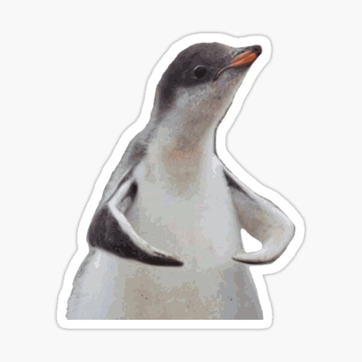

# My User Page

## About Me

Hello, my name is Zhicheng Wang. I am a second-year math student double majoring in cognitive science with 
a specialization in machine learning and minoring in design. I am really interested in the software industry
and hope to become a full-stack software engineer one day

If you are interested, this is a link to my [Linkedin Page](https://www.linkedin.com/in/jackson-wang1/)

My favorite *quote* is 

>What Doesn't Kill You Makes You Stronger.



```
System.out.println("Fight me");
```

If you wanted to take a closer look at the cute penguin above! [CLICK ME!!!](penguin.jpg)

My favoriate Chinese Food are...
- Kung Pao Chicken
- Ma Po Tofu
- Xiaolongbao (Soup Dumplings)

My short-term goals...
1. Land an internship
2. Straight As
3. Get into a Relationship

Things I am trying to accomplish...
- [x] Sleep 8 hours a day
- [ ] adopt a cat

This is a link back to the top [^^^](https://github.com/Zhicheng-wan/CSE110/blob/main/index.md#about-me)
